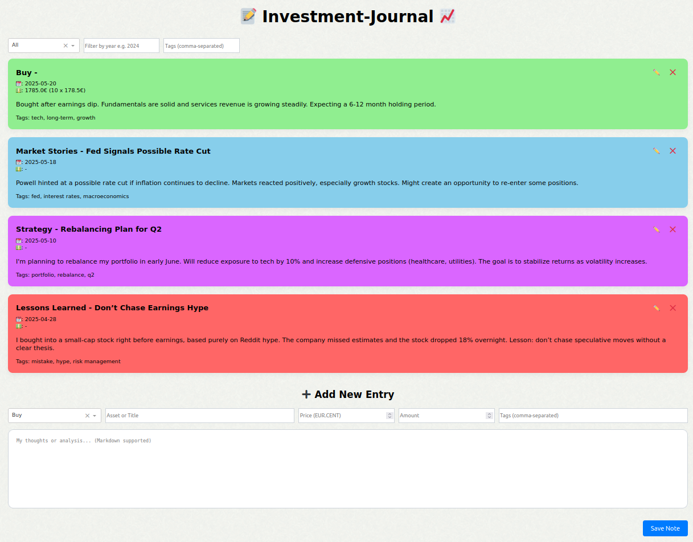

# Personal Investment Journal

A simple, personal, and modern Dash-based web application for journaling your investment thoughts, trades, market stories, and lessons learned. Built to reflect, learn, and grow over time.



## Features

- Add and delete entries in categories like **Buy**, **Sell**, **Market Stories**, **Lessons Learned**, **Strategy**, and **Success Stories** (visualized in different colors)
- Filter by category, year, or tags
- Write notes in Markdown
- Stores entries in a YAML file serving as the database (`journal.yaml`)

## Getting Started

### 1. Clone the repository

```bash
git clone https://github.com/your-username/investment-journal.git
cd investment-journal
```

### 2. Set up your environment

I recommend using a virtual environment:

```bash
python -m venv venv
source venv/bin/activate   # On Windows: venv\Scripts\activate
```

### 3. Install dependencies

```bash
pip install -r requirements.txt
```

### 4. Create your database file 
Create a "journal.yaml" in the root folder of this repository. This file serves as a simple database of the full journal.
### 5. Run the app and visit: http://127.0.0.1:8050


```bash
python app.py
```


